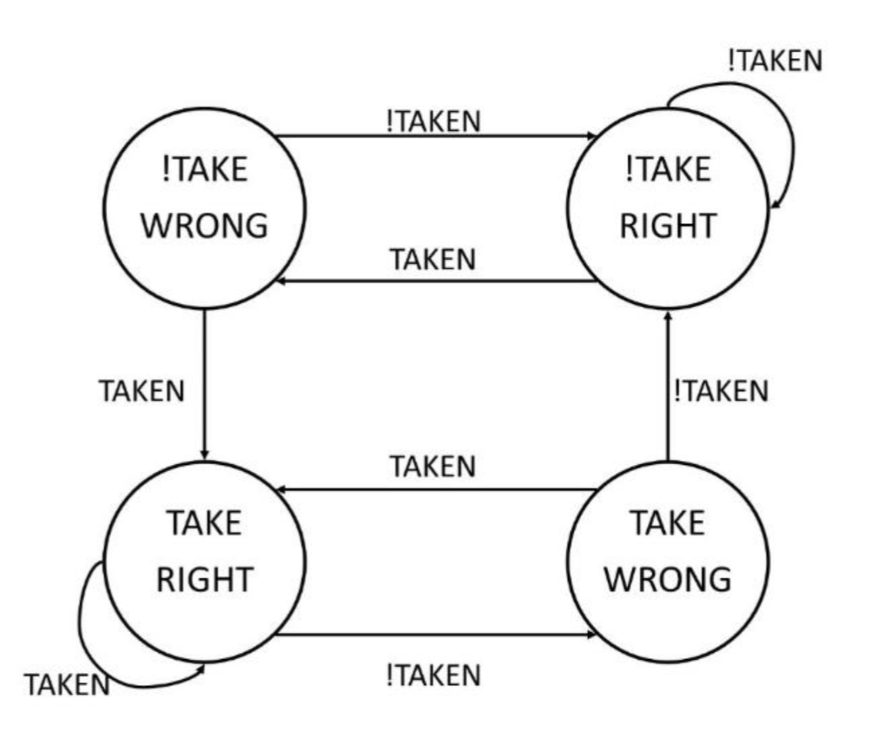
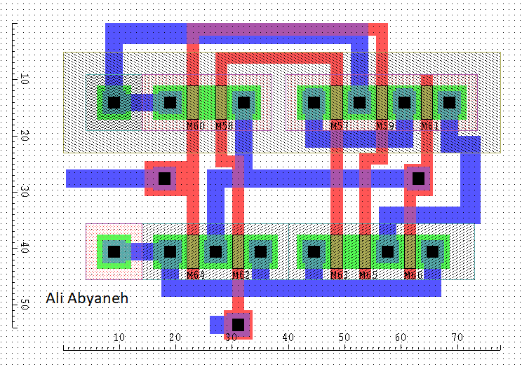
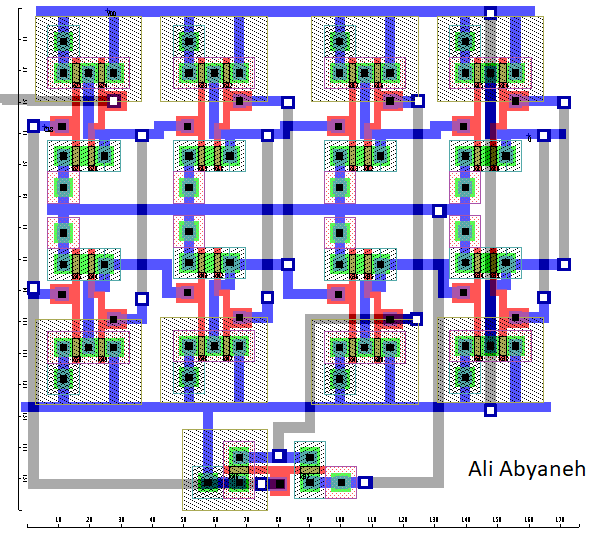

# branch-predictor-layout-in-Ledit
layout was designed in Ledit, the goal was minimizing the area, the extracted netlist of the layout was verified with simulation.

### two-bit branch predictor state machine

### two-bit branch predictor digital circuit

### Not Gate layout

### NAND Gate layout

### XOR Gate layout

### DFF layout

